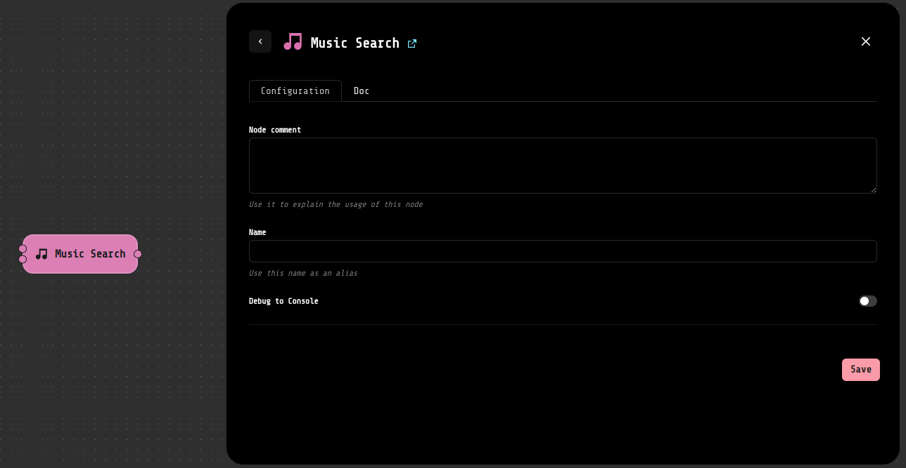

# music_search

This is the Music Search, the loko extension of your music.

To use it is really simple! 

You can load a file in mp3, flac, etc of your music, of course there is a song that 
doesn't have the title and author. 

Use your module "Music Search". 

You have a wait just a little a bit for seconds and... this is the author and title of your result!
